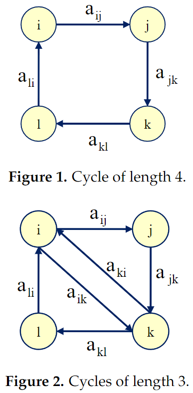

<!-- _class: title -->

# The Triads Geometric Consistency Index   in AHP-Pairwise Comparison Matrices
  

Aguarón J, Escobar MT, Moreno-Jiménez JM, Turón A (2020)

---

# AHP の導入

---

# Introduction

PCM $A = (a_{ij})$ は次を満たすときに整合している. [4, 9]

$$
a_{ij} a_{jk} a_{ki} = 1, ~~ \forall i,j,k = 1, \dots, n
$$

PCM の整合性の多くは順位付けの手続き (重みの求め方) に依存している.
一方で, 整合性の定義に基づいて定義し, 特定の順位付け方法と結びついていない整合性指標も提案されている.

本論文では, 特定の順位付け方法と結びついておらず Geometric Consistency Index ($\mathrm{GCI}$) と値が一致する Triads Geometric Consistency Index ($\mathrm{T\text{-}GCI}$) を提案する.

---

# Introduction

## 論文の構成

2. 従来の整合性の概念
3. $\mathrm{T\text{-}GCI}$ の定義
4. $\mathrm{GCI}$ と $\mathrm{T\text{-}GCI}$ の関係とその証明
5. より長いサイクルで同様の整合性指標を定義しても
$\mathrm{T\text{-}GCI}$ と値が一致することの証明
    ($\mathrm{T\text{-}GCI}$ は $a_{ij}, a_{jk}, a_{ki}$ の長さ 3 のサイクルを考えている)

---

# Consistency in the Analytic Hierarchy Process

## 整合性指標の分類

PCM の整合性指標は以下の二つのグループに分類することができる.

1. 特定の順位付け方法と結びついているもの
2. triads に基づくもの (Saaty の与えた (完全) 整合の定義に基づくもの)

---

# Consistency in the Analytic Hierarchy Process

## $\mathrm{CI}, \mathrm{CR}$

固有値法では PCM $A = (a_{ij})$ から次のように重要度ベクトル $w = (w_i)$ を求める.

$$
\begin{align*}
A w & = \lambda_\mathrm{max} w \\
& \text{ with } ~~ w_i \geq 0, ~~ i = 1, \dots, n \\
& \text{ and } ~~ \sum_{i=1}^n w_i = 1
\end{align*}
$$

($\lambda_\mathrm{max}$ は PCM $A$ の最大固有値)

---

# Consistency in the Analytic Hierarchy Process

この順位付け方法に基づいて, 整合性指標 $\mathrm{CI}$ が定義される.

$$
\begin{align*}
\mathrm{CI}(A)
& = \frac{\lambda_\mathrm{max} - n}{n - 1} \\
& = \frac{1}{n(n-1)} \sum_{i \neq j}^n \left( a_{ij} \frac{w_j}{w_i} - 1 \right)
\qquad \left( \because \lambda_\mathrm{max} = \sum_{j = 1}^n a_{ij} \frac{w_j}{w_i} \right)
\end{align*} 
$$

$\lambda_\mathrm{max} = \sum_{j = 1}^n a_{ij} w_j / w_i$ は, $w$ が固有値法の重要度ベクトル ($A$ の最大固有値 $\lambda_\mathrm{max}$ に対応する固有ベクトル) であるときに成り立つ. 
$\mathrm{CI}$ は固有値法と結びついている.

同様に, $\mathrm{CR}(A) = \mathrm{CI}(A) / \mathrm{RI}(n)$ もまた固有値法と結びついている.

---

# Consistency in the Analytic Hierarchy Process

$$
\begin{align*}
\frac{1}{n(n-1)} \sum_{i \neq j} \left( a_{ij} \frac{w_j}{w_i} - 1 \right)
& = \frac{1}{n(n-1)} \left( -n^2 + \underset{= \sum_{i = j} a_{ij} w_j / w_i}{\underline{n}} + \sum_{i \neq j} a_{ij} \frac{w_j}{w_i} \right) \\
& = \frac{1}{n(n-1)} \left( -n^2 + \sum_{i = 1}^n \underset{= \lambda_\mathrm{max}}{\underline{\sum_{j = 1}^n a_{ij} \frac{w_j}{w_i}}} \right) \\
& = \frac{1}{n(n-1)} \left( -n^2 + \sum_{i=1}^n \lambda_\mathrm{max} \right) \\
& = \frac{\lambda_\mathrm{max} - n}{n - 1}
\end{align*}
$$

---

# Consistency in the Analytic Hierarchy Process

## $\mathrm{GCI}$

行幾何平均法の重要度ベクトル $w = (w_i)$ を次のように求める.

$$
w_i = \prod_{j=1}^n a_{ij}^\frac{1}{n}
$$

Geometric Consistency Index ($\mathrm{GCI}$) は次のように定義される.

$$
\mathrm{GCI}(A) = \frac{1}{(n-1)(n-2)} \sum_{i, j} \left( \log \left( a_{ij} \frac{w_j}{w_i} \right) \right)^2
$$

行幾何平均法の重要度ベクトル $w$ を用いて定めているので,
$\mathrm{GCI}$ は明らかに行幾何平均法と結びついている.

---

# Consistency in the Analytic Hierarchy Process

## Koczkodaj の整合性指標 [30]

次の triads に基づく整合性指標は特定の順位付け方法と結びついていない. [30]

$$
\mathrm{KI}(A) = \max_{i < j < k} \left\{ \min \left\{ \left| 1 - \frac{a_{ik}}{a_{ij} a_{jk}} \right|, \left| 1 - \frac{a_{ij} a_{jk}}{a_{ik}} \right| \right\} \right\}
$$

推移率の破れが最大の triads $a_{ij}, a_{jk}, a_{ki}$ に注目している.

$a_{ij} a_{jk} a_{ki} > 1$ となるサイクルを考慮している.

<!-- 次のように, $a_{ij}$ と $a_{ik} a_{kj}$ とのずれを $a_{ij}$ (比率尺度なので) で正規化したものを考えている.

$$
\begin{align*}
& \min \left\{ \frac{| a_{ij} - a_{ik} a_{kj} |}{a_{ij}}, \frac{| a_{ik} - a_{ij} a_{jk} |}{a_{ik}}, \frac{| a_{jk} - a_{ji} a_{ik} |}{a_{jk}} \right\} \\
= ~~ & \min \left\{ \frac{| a_{ij} a_{jk} - a_{ik}|}{a_{ij} a_{jk}}, \frac{| a_{ik} - a_{ij} a_{jk} |}{a_{ik}}, \frac{|a_{ij} a_{jk} - a_{ik}|}{a_{ij} a_{jk}} \right\} \\ 
= ~~ & \min \left\{ \left| 1 - \frac{a_{ik}}{a_{ij} a_{jk}} \right|, \left| 1 - \frac{a_{ij} a_{jk}}{a_{ik}} \right| \right\} \\
\end{align*}
$$ -->

---

# Consistency in the Analytic Hierarchy Process

## Palaez と Lamata の整合性指標 [31]

次の triads に基づく整合性指標は特定の順位付け方法と結びついていない. [31]

$$
\mathrm{PLI}(A) = \sum_{i < j < k} \left( \frac{a_{ik}}{a_{ij} a_{jk}} + \frac{a_{ij} a_{jk}}{a_{ik}} - 2 \right) / 
\begin{pmatrix} n \\ 3 \end{pmatrix}
$$

PCM $A$ が完全整合しているとき, PCM $A$ から $i, j, k$ の 3 行 3 列を取り出した 3 次元の行列 $A_{ijk}$ について次が成り立つ.

$$
\mathrm{det}(A_{ijk}) = \underset{=1}{\underline{\frac{a_{ik}}{a_{ij} a_{jk}}}} + \underset{=1}{\underline{\frac{a_{ij} a_{jk}}{a_{ik}}}} - 2 = 0,
\quad i, j, k \in N, ~~ i \neq j, j \neq k, k \neq i
$$

この行列式の平均を計算している.

## その他の整合性指標

[41] にさらに多くの整合性指標がまとめられている.

---

# The Triads Geometric Consistency Measure

## 数値例

次の PCM $A, B$ を考える.

$$
A = \begin{pmatrix}
1 & 2 & 7 \\
1/2 & 1 & 3 \\
1/7 & 1/3 & 1
\end{pmatrix}, \quad
B = \begin{pmatrix}
1 & 2 & 9 \\
1/2 & 1 & 3 \\
1/9 & 1/3 & 1
\end{pmatrix}
$$

$a_{12} a_{23} \neq a_{13}, ~~ (2 \times 3 \neq 7)$, $b_{12} b_{23} \neq b_{13}, ~~ (2 \times 3 \neq 9)$ なので, $A, B$ はともに整合していない.

直感的に $A$ は $B$ よりも整合している.
$\mathrm{CR}, \mathrm{GCI}$ をそれぞれ計算すると, $\mathrm{CR}(A) = 0.002, ~ \mathrm{GCI}(A) = 0.008, ~ \mathrm{CR}(B) = 0.017, ~ \mathrm{GCI}(B) = 0.055$ となり, $A$ が $B$ よりも整合していることが確かめられる.

---

# The Triads Geometric Consistency Measure

## Triads に基づく整合性の評価

どちらの行列がより整合しているかを評価するために, 必ずしもある順位付け方法を適用して, 対応する整合性指標を計算する必要はない.

ここでは triads に基づく一貫性の評価を考える.
長さ 3 のサイクルの強度を評価する.
強度が 1 に近いほどそのサイクルは整合している.

<!-- 長さ 3 のサイクルの強度の 1 からの偏差 $d_{ijk} = f(a_{ij} a_{jk} a_{ki})$ をすべての $i, j, k$ について計算する. -->

$$
M = g\left( d_{123}, \ldots, d_{ijk} \ldots d_{n(n-1)(n-2)} \right), \quad i \neq j \neq k
$$

---

# The Triads Geometric Consistency Measure

## $d_{ijk} = a_{ij} a_{jk} a_{ki} - 1$ の和

まず, 単純に $d_{ijk} = a_{ij} a_{jk} a_{ki} - 1$ の和をとった $M_1$ を考えることができる.

$$
M_1 = \sum_{i \neq j \neq k} \left( a_{ij} a_{jk} a_{ki} - 1 \right)
$$

---

# The Triads Geometric Consistency Measure

## $d_{ijk} = a_{ij} a_{jk} a_{ki} + (a_{ij} a_{jk} a_{ki})^{-1} - 2$ の和

$a_{ij} a_{jk} a_{ki}$ と $(a_{ij} a_{jk} a_{ki})^{-1}$ は整合していない限り, 一方が 1 より小さく, もう一方が 1 より大きい.
逆数 $(a_{ij} a_{jk} a_{ki})^{-1}$ を考慮すると, 次のように書ける. 

$$
M_1 = 3 \sum_{i < j < k} \left( a_{ij} a_{jk} a_{ki} + \frac{1}{a_{ij} a_{jk} a_{ki}} - 2 \right)
$$

係数部分以外は Pelaez and Lamata の整合性指標 $\mathrm{PLI}$ [31] と同じである. ($\mathrm{PLI}$ は平均)

---

# The Triads Geometric Consistency Measure

## 1 より強度が大きいサイクルと小さいサイクル

整合していない二つのサイクル $a_{ij} a_{jk} a_{ki}$ と $a_{ik} a_{kj} a_{ji} = (a_{ij} a_{jk} a_{ki})^{-1}$ は整合性尺度に逆方向の影響を与える.
これらが相殺してしまうことを回避するためのアプローチとして, 次が考えられる.

**1. 強度が 1 より大きい, あるいは 1 より小さいサイクルのみを考慮する**

$M_1$ において強度が 1 より大きいサイクルのみを考慮する.

$$
M_2 = \max_{i < j < k} \left\{ a_{ij} a_{jk} a_{ki} - 1 ~~ \text{with} ~~ a_{ij} a_{jk} a_{ki} > 1 \right\}
$$

これは Koczkodaj の整合性指標 $\mathrm{KI}$ [30] に等しい.

**2. 定義そのものを考慮する**

$a_{ij} a_{jk} a_{ki}$ と $a_{ik} a_{kj} a_{ji}$ の影響が同じになるように指標を定める.
そのために, ここでは強度の対数をとる.

---

# The Triads Geometric Consistency Measure

## $\mathrm{T\text{-}GCI}$

$d_{ijk} = \left( \log (a_{ij} a_{jk} a_{ki}) - \log 1 \right)^2 = \left( \log (a_{ij} a_{jk} a_{ki}) \right)^2$ とする.

### Definition 1.

PCM $A = (a_{ij})$ に対して, Triads Geometric Consistency Measure ($\mathrm{T\text{-}GCI}$) を次のように定義する.

$$
\mathrm{T\text{-}GCI}(A) = \frac{1}{3n(n-1)(n-2)} \sum_{i \neq j \neq k} \left( \log (a_{ij} a_{jk} a_{ki}) \right)^2
$$

サイクルの長さ 3 で割っている. こうすることで, 3 以上のどのサイクルの長さでも同じ値が得られる.

---

# The Triads Geometric Consistency Measure

### Remark 1.

$d_{ijk}$ の $i, j, k$ を入れ替えても値は変わらない.
そのため, 次が成り立つ.

$$
\mathrm{T\text{-}GCI}(A) = \frac{2}{n(n-1)(n-2)} \sum_{i < j < k} \left( \log (a_{ij} a_{jk} a_{ki}) \right)^2
$$

---

# A Link between the Two Groups of Inconsistency Measures

## Theorem 1.

PCM $A = (a_{ij})$ に対して次が成り立つ.

$$
\mathrm{T\text{-}GCI}(A) = \mathrm{GCI}(A)
$$

これによって, $\mathrm{GCI}$ のと同じしきい値 [10] を使うことができる.
$n = 3$ で $\mathrm{T\text{-}GCI} = 0.31$, $n = 4$ で $\mathrm{T\text{-}GCI} = 0.35$, $n > 4$ で $\mathrm{T\text{-}GCI} = 0.37$.

また, $\mathrm{GCI}$ と同じ値をとることから整合性指標の公理 [50, 52] を満たすことが確かめられる.

<!-- ---

# A Link between the Two Groups of Inconsistency Measures

## 整合性指標の公理 [50, 52]

1. 完全整合を表す整合性指標の値が存在する
2. 代替案の順番を変えても整合性指標の値は変わらない（匿名性）
3. PCM の各成分を $b \geq 1$ 乗した PCM の整合性指標の値は, 元の PCM の整合性指標の値よりも大きくなる
4. 
5. 整合性指標の関数 $I$ は $a_{ij}, i,j \in N$ 全てについて連続関数
6. 全ての一対比較値を逆にしても整合性指標の値は変わらない -->

---

# Computational Complexity

コンピュータ上では, 乗算と除算, 対数関数と指数関数の計算コストはそれぞれ同じであるため, 乗算と対数関数にまとめる.

## $\mathrm{GCI}$ の計算量

$\mathrm{GCI}$ の計算においては, まず $\prod_{j = 1}^n a_{ij}, ~ i = 1, \ldots, n$ を計算する.
ここで $n(n-1)$ 回積をとる.
$n$ 乗根 $\left( \prod_{j = 1}^n a_{ij} \right)^\frac{1}{n}$ の計算のために, $n$ 回の対数関数, 除算, 指数関数の計算が必要である.
ここまでを合計すると, $n^2$ 回の積と $2n$ 回の対数関数の計算が必要.

$e_{ij} = a_{ij} w_j / w_i$ の計算には, 2 回の積の計算が必要.
$e_{ij}$ から $(\log e_{ij})^2$ を計算するために, 1 回の積と 1 回の対数関数の計算が必要.
非対角成分すべてを計算するには $3n(n-1)/2$ 回の積の計算と $n(n-1)/2$ 回の対数関数の計算が必要.

---

# Computational Complexity

$\sum_{i,j} (\log e_{ij})^2$ の計算のために, $n(n - 1)/2 - 1$ 回和をとる.

$1 / 2n(n-1)$ の計算と, それを $\sum_{i,j} (\log e_{ij})^2$ にかけるために, 3 回積をとる.

合計は次のようになる.

| 計算 | 回数 |
| --- | --- |
| 和 | $\frac{n(n-1)}{2} - 1$ |
| 積 | $n^2 + \frac{3n(n-1)}{2} + 3$ |
| 対数関数 | $2n + \frac{n(n-1)}{2}$ |

---

# Computational Complexity

## $\mathrm{T\text{-}GCI}$ の計算量

triad に関して, $\log^2 a_{ij} a_{jk} a_{ki}$ を計算する.
この計算には 3 回の積 と 1回の対数関数が必要.

これらを $n(n - 1)(n - 2)/6$ 個の triad に対して行うので,
合計で $n(n - 1)(n - 2)/2$ 回の積と $n(n - 1)(n - 2)/6$ 回の対数関数の計算が必要.

$\log^2 a_{ij} a_{jk} a_{ki}$ の和の計算で, $n(n - 1)(n - 2)/6 - 1$ 回の和をとる.

$6 / n(n - 1)(n - 2)$ の計算と, それを $\sum_{i<j<k} (\log^2 a_{ij} a_{jk} a_{ki})$ にかけるために, 4 回積をとる.

---

# Computational Complexity

合計は次のようになる.

| 計算 | 回数 |
| --- | --- |
| 和 | $\frac{n(n-1)(n-2)}{6} - 1$ |
| 積 | $\frac{3n(n-1)(n-2)}{2} + 4$ |
| 対数関数 | $\frac{n(n-1)(n-2)}{6}$ |

---

# Computational Complexity

## $\mathrm{GCI}$ と $\mathrm{T\text{-}GCI}$ の計算量の比較

$\mathrm{GCI}$ の計算量のオーダーは $O(n^2)$ で, $\mathrm{T\text{-}GCI}$ の計算量のオーダーは $O(n^3)$ である.

しかし, $n < 8$ では $\mathrm{T\text{-}GCI}$ の方が必要な操作の数が少ない.

---

# Example

$n=4$ では $\mathrm{T\text{-}GCI}$ の方が必要な操作の数が少ない.

$$
A = \begin{pmatrix}
1 & 2 & 3 & 4 \\
1/2 & 1 & 5 & 6 \\
1/3 & 1/5 & 1 & 7 \\
1/4 & 1/6 & 1/7 & 1
\end{pmatrix}
$$

$\mathrm{GCI}$ の計算過程：

---

# Example

$\mathrm{T\text{-}GCI}$ の計算過程：

---

# Inconsistency Measures Based on Cycles

PCM $A$ が整合しているとき, 次が成り立つ.

$$
a_{i_1 i_2} a_{i_2 i_3} \cdots a_{i_{l-1} i_l} a_{i_l i_1} = 1,
\quad
\forall i_1, i_2, \dots, i_l
$$

ただし, $l > 2$ はサイクルの長さ.

任意のサイクル長 $l >2$ に対して, 整合性尺度を定めることができる.

## Definition 2.

PCM $A = (a_{ij})$ に対して, Cycles Consistency Index を次のように定める.

$$
I_l(A) = \frac{1}{l V_{n,l}} \sum_{i_1 \neq i_2 \neq \cdots \neq i_l} \left( \log \left( a_{i_1 i_2} a_{i_2 i_3} \cdots  a_{i_l i_1} \right) \right)^2
$$

ただし, $V_{n,l} = n (n-1) \cdots (n-l+1)$ である.

---

# Inconsistency Measures Based on Cycles

## Remark 2.

長さが 3 より大きいサイクルは複数の長さ 3 のサイクルに帰着する.
例えば, $n = 4$ のとき, 次のようになる.

$$
a_{ij}a_{jk}a_{kl}a_{li} = a_{ij}a_{jk}(a_{ki}a_{ik})a_{kl}a_{li} = (a_{ij}a_{jk}a_{ki})(a_{ik}a_{kl}a_{li})
$$

---

# Inconsistency Measures Based on Cycles

長さ 4 のサイクルでの強度 $d_{ijkl} = f(a_{ij}a_{jk}a_{kl}a_{li})$ は,
複数の長さ 3 のサイクルの強度の関数 $d_{ijkl} = f^\prime(d_{ijk}, d_{ikl})$ として得られる.

## Theorem 2.

PCM $A = (a_{ij})$ と任意のサイクル長 $l > 2$ に対して次が成り立つ.

$$
I_l(A) = \mathrm{GCI}(A)
$$

$I_l(A)$ の計算量のオーダーは $O(n^l)$ で, $l$ が大きいほど計算は複雑になる.
得られる値は同じなので, $n = 3$, すなわち $\mathrm{T\text{-}GCI}$ を考慮すれば良い.

---

# Conclusion

- $\mathrm{CR}, \mathrm{GCI}$ といった特定の順位付け方法と結びついた整合性指標が広く用いられてきた
- triads に基づく整合性指標は, 特定の順位付け方法と結びついていない
- triads に基づく新しい整合性指標 $\mathrm{T\text{-}GCI}$ を提案した
- $\mathrm{T\text{-}GCI}$ の値は $\mathrm{GCI}$ と一致する
- $n < 8$ では $\mathrm{T\text{-}GCI}$ は $\mathrm{GCI}$ より計算が容易である
- 任意のサイクル長で $\mathrm{T\text{-}GCI}$ と同様に整合性指標を定めても同じ値が得られる
